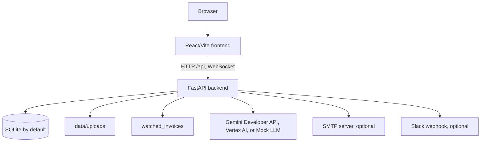
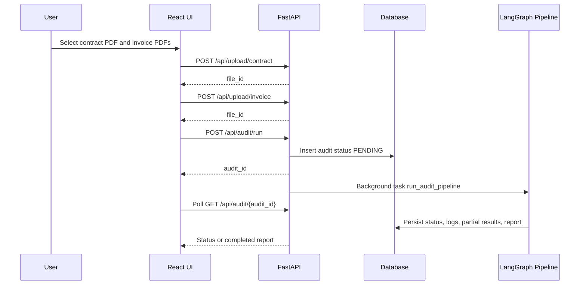
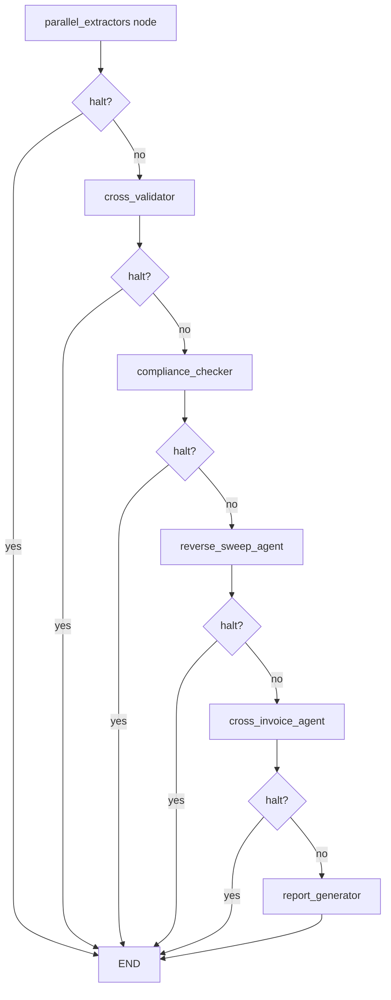
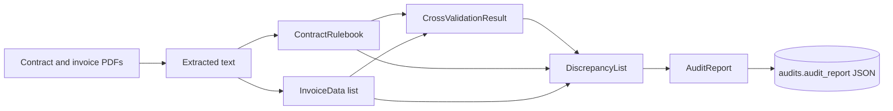

# Architecture

**Audience:** Developers and solution architects.

This document describes the current SupplierGuard / ProcureAI implementation. The source code is authoritative; historical architecture files in `docs/archive/` are retained for context only.

## Purpose

SupplierGuard audits supplier invoices against contract terms. Users upload contracts and invoices, or register contracts and drop invoices into a watched folder. The backend extracts PDF text, uses LLM-assisted agents to structure contracts and invoices, applies deterministic Python rule evaluation, stores results, and serves a React dashboard for reports, disputes, supplier analytics, contract Q&A, and contract comparison.

## Runtime Components

| Component | Path | Responsibility |
|---|---|---|
| FastAPI app | `backend/main.py` | Application entry point, router registration, CORS setup, file-watcher lifespan |
| API routes | `backend/api/routes/` | Uploads, audits, suppliers, analytics, disputes, settings, contracts, watcher, health |
| Agent pipeline | `backend/agents/pipeline.py` | LangGraph workflow orchestration |
| Agent implementations | `backend/agents/*` | Contract parsing, invoice extraction, validation, compliance, reverse sweep, cross-invoice analysis, report generation |
| Core utilities | `backend/core/` | Config, database, LLM client, PDF extraction, logging, prompts, tasks |
| Services | `backend/services/` | Analytics, notifications, file watcher, contract chunking, comparison, disputes, scoring |
| ORM models | `backend/models/audit.py` | Database tables |
| Pydantic schemas | `backend/models/schemas.py` | API and pipeline contracts |
| Frontend app | `frontend/src/` | React UI, API client, pages, reusable components |
| Scripts | `scripts/` | Database initialization, migration, synthetic data, cleanup helpers |

## Deployment Shape

The frontend reads `VITE_API_URL` and prefixes API calls with `/api`. The backend reads `.env` files from the repository root and `backend/.env`, with backend values loaded after root values.

## Request Flow: Manual Audit

## Audit Pipeline

`backend/agents/pipeline.py` builds a LangGraph workflow:

The `parallel_extractors` name is logical. In the current implementation, it first runs the invoice extractor, then runs the contract parser, while preserving the architectural intent that extractor failures are recorded independently before the cross-validation gate decides whether the pipeline can continue.

### Stage Responsibilities

| Stage | Implementation | Responsibilities |
|---|---|---|
| PDF extraction | `backend/core/pdf_extractor.py` | Extract text with `pdfplumber`; fall back to `pypdf`; fail scanned/corrupt PDFs without text |
| Invoice extractor | `backend/agents/invoice_extractor/agent.py` | Extract invoice headers, line items, totals, conditional facts, arithmetic validation |
| Contract parser | `backend/agents/contract_parser/agent.py` | Extract `ContractRulebook` and `PricingRule` objects from contract text; supports self-consistency passes |
| Cross validator | `backend/agents/cross_validator/validator.py` | Fuzzy candidate mapping, unmapped line detection, missing data flags |
| Compliance checker | `backend/agents/compliance_checker/agent.py` and `rule_engine.py` | Match candidate rules, compute expected charges with Python evaluators, create discrepancies, run critic annotation |
| Reverse sweep | `backend/agents/reverse_sweep/agent.py` | Detect missing credits from contract-triggered events such as SLA, early payment, and bundle credits |
| Cross-invoice analyzer | `backend/agents/cross_invoice_analyzer/agent.py` | Detect price drift across multiple invoices |
| Report generator | `backend/agents/report_generator/agent.py` | Aggregate summary, recommendations, narratives, missing credits, price drifts |

## Data Flow

The primary persisted audit record is the `audits` table. Structured agent outputs are stored as JSON strings in columns such as `rulebook`, `invoice_data`, `discrepancies`, and `audit_report`.

## Database Interaction

The backend uses an async SQLAlchemy engine from `backend/core/db.py`. SQLite URLs are converted from `sqlite:///...` to `sqlite+aiosqlite:///...`. For SQLite, foreign keys and WAL mode are enabled on connection.

Database tables are declared in `backend/models/audit.py`; see [DATA_SCHEMAS.md](DATA_SCHEMAS.md) and [docs/DATABASE.md](docs/DATABASE.md).

## Frontend Architecture

The frontend is a React 19 + Vite app. `frontend/src/App.jsx` uses local state to switch between application views rather than a URL router. `frontend/src/api.js` centralizes fetch calls, derives the base URL from `VITE_API_URL`, and adds `X-API-Key` when `VITE_API_KEY` is set.

Main views:

- Audit list
- Upload and risk prediction
- Audit running/progress
- Audit report
- Supplier scorecard and history
- Analytics and heatmap
- Contract library
- Auto-audit watcher
- Contract comparison
- Notification settings

## External Integrations

| Integration | Implementation | Notes |
|---|---|---|
| Gemini Developer API | `backend/core/llm_client.py` | Used when `GEMINI_API_KEY` is set |
| Vertex AI | `backend/core/llm_client.py` | Used when no API key is set and Google Cloud config is available |
| Mock LLM | `backend/core/mock_router.py` | Enabled only when `MOCK_LLM=true` and `ALLOW_MOCK_LLM=true` |
| Slack | `backend/services/notifier.py` | Optional notification webhook |
| SMTP email | `backend/services/notifier.py` | Optional notification email |
| File watcher | `backend/services/file_watcher.py` | Watches `watched_invoices/` for new invoice PDFs |

## Security Boundary

FastAPI currently mounts permissive CORS in `backend/main.py` with `allow_origins=["*"]`. API-key and rate-limit middleware are implemented but not registered by the app. File access for audit runs is limited to configured upload paths and `data/synthetic`.

See [docs/SECURITY.md](docs/SECURITY.md) for operational guidance and implementation caveats.

## Known Assumptions

- The repository contains no Docker, Kubernetes, or CI/CD configuration files.
- PostgreSQL is mentioned in configuration patterns, but the checked-in backend requirements do not include a PostgreSQL async driver.
- Frontend navigation is state-based; direct deep links to individual views are not implemented in `App.jsx`.
