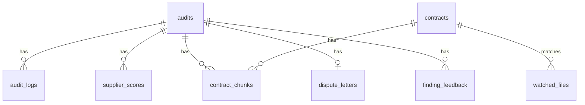

# Data Schemas and Persistence Reference

**Audience:** Developers.

This reference summarizes data contracts from `backend/models/schemas.py` and database tables from `backend/models/audit.py`. The code remains authoritative.

## Pipeline State

`PipelineState` is a `TypedDict` passed through the LangGraph workflow.

| Field | Type | Purpose |
|---|---|---|
| `audit_id` | `str` | Audit primary key |
| `contract_path` | `str` | Stored contract PDF path |
| `invoice_paths` | `List[str]` | Stored invoice PDF paths |
| `contract_text` | `str` | Extracted contract text |
| `invoice_texts` | `List[str]` | Extracted invoice texts |
| `rulebook` | optional `Dict` | Serialized `ContractRulebook` |
| `invoice_data` | optional `List[Dict]` | Serialized `InvoiceData` records |
| `cross_validation` | optional `Dict` | `CrossValidationResult` |
| `candidate_map` | optional `Dict` | Line-to-rule candidate map |
| `discrepancies` | optional `List[Dict]` | Serialized `DiscrepancyList` |
| `data_required_flags` | optional `List[Dict]` | Missing data flags |
| `review_flags` | optional `List[Dict]` | Human review flags |
| `audit_report` | optional `Dict` | Serialized `AuditReport` |
| `errors` | `List[Dict]` | Agent error records |
| `current_agent` | `str` | Current pipeline stage |
| `halt` | optional `bool` | Stops downstream graph nodes when true |
| `unit_conversions` | optional `Dict` | Unit conversion metadata |
| `reverse_sweep` | optional `Dict` | Reverse sweep results |
| `cross_invoice` | optional `Dict` | Cross-invoice analysis results |

## Monetary Values

Money-like schema fields use `CleanDecimal`, an annotated `Decimal` type with `normalize_decimal`. The normalizer strips currency symbols, commas, spaces, and common non-numeric tokens before parsing.

Important behavior:

- `None` defaults to `Decimal("0.00")` and logs a warning.
- Unparseable values log warnings or errors before returning `0.00`.
- Numeric calculations in compliance evaluation should use `Decimal`, not floats.

## Core Pydantic Models

### ContractRulebook

| Field | Type |
|---|---|
| `supplier_name` | `str` |
| `contract_id` | `str` |
| `contract_date` | optional `str` |
| `contract_currency` | `str`, default `INR` |
| `rules` | `List[PricingRule]` |
| `unextracted_sections` | `List[str]` |
| `extraction_notes` | `str` |

### PricingRule

`rule_type` is one of:

- `volume_tier`
- `flat_rate`
- `sla_penalty`
- `early_payment_discount`
- `bundle_discount`
- `cap_rate`
- `annual_adjustment`
- `milestone_penalty`
- `unknown`

Key fields include `rule_id`, `description`, `clause_reference`, `clause_text`, `applies_to`, effective dates, rule-specific numeric fields, `extraction_confidence`, clause offsets, and self-consistency vote metadata.

### InvoiceData

| Field | Type |
|---|---|
| `invoice_id` | `str` |
| `invoice_date` | `str` |
| `billing_period` | `str` |
| `supplier_name` | `str` |
| `invoice_total` | `CleanDecimal` |
| `line_items` | `List[LineItem]` |
| `validation` | `InvoiceValidation` |
| `notes` | `str` |
| `milestone_statements` | `List[str]` |
| `penalties_applied` | optional `float` |
| `invoice_arithmetic_valid` | `bool` |

### Discrepancy

`Discrepancy` records a finding with invoice, line, rule, charged amount, expected amount, delta, severity, recommendation, confidence, critic status, and optional narrative.

Valid `critic_status` values:

- `CONFIRMED`
- `NEEDS_HUMAN_REVIEW`

Valid `recommendation` values:

- `DISPUTE`
- `ESCALATE`
- `MONITOR`
- `REVIEW`

### AuditReport

`AuditReport` contains:

- `audit_id`
- `summary`
- `discrepancies`
- `compliant_lines`
- `recommendations`
- `report_generated_at`
- `data_required_flags`
- `review_flags`
- `rules_never_billed`
- `missing_credits`
- `price_drifts`

## API Schemas

| Schema | Used by |
|---|---|
| `UploadResponse` | `/api/upload/contract`, `/api/upload/invoice` |
| `AuditRequest` | `/api/audit/run` |
| `AuditStatusResponse` | `/api/audit/{audit_id}` |
| `AuditListItem` | `/api/audits` |
| `SupplierScoreCard` | `/api/suppliers` |
| `SupplierSummaryKPIs` | `/api/suppliers/summary` |
| `HeatmapData` | `/api/analytics/heatmap` |
| `DisputeLetterRequest` | `/api/disputes/generate` |
| `DisputeLetterRevisionRequest` | `/api/disputes/revise` |
| `ChatRequest` | `/api/contracts/{audit_id}/chat` |
| `AliasUpdate` | `/api/contracts/{id}/aliases` |
| `ComparisonResult` | contract comparison result |
| `NegotiationBrief` | supplier negotiation brief endpoints |

## Database Tables

| Table | ORM class | Purpose |
|---|---|---|
| `audits` | `Audit` | Audit lifecycle, PDF paths, agent JSON outputs, report JSON, leakage totals |
| `audit_logs` | `AuditLog` | Timestamped audit pipeline logs |
| `dispute_letters` | `DisputeLetter` | Generated and revised dispute letters |
| `supplier_scores` | `SupplierScore` | Per-audit supplier score snapshots |
| `notification_settings` | `NotificationSettings` | Slack, email, and alert settings |
| `contract_chunks` | `ContractChunk` | Chunked contract text for Q&A retrieval |
| `contracts` | `Contract` | Contract library records, aliases, hashes, versions, validity dates, rulebooks |
| `watched_files` | `WatchedFile` | Auto-audit file watcher history |
| `comparisons` | `Comparison` | Contract comparison jobs and results |
| `negotiation_briefs` | `NegotiationBrief` | Generated supplier negotiation briefs |
| `finding_feedback` | `FindingFeedback` | Human review verdicts for findings |

## Status Values

Audit statuses used by the API include:

- `PENDING`
- `EXTRACTING_PDF`
- `PARSING_CONTRACT`
- `EXTRACTING_INVOICES`
- `CROSS_VALIDATING`
- `CHECKING_COMPLIANCE`
- `GENERATING_REPORT`
- `COMPLETE`
- `FAILED`

Watcher statuses include values such as `MATCHING`, `PROCESSING`, `UNMATCHED`, `COMPLETE`, and `FAILED`.
