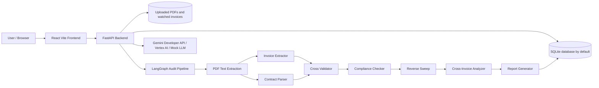

# SupplierGuard / ProcureAI

**Audience:** Developers, technical evaluators, and application users.

SupplierGuard, branded in code as ProcureAI, is a local-first contract compliance and invoice audit application. It lets users upload supplier contract PDFs and invoice PDFs, runs a multi-agent analysis pipeline, detects billing leakage, and presents audit reports, supplier scorecards, analytics, dispute letters, contract library workflows, and automated invoice intake.

The implementation is the source of truth for this documentation. Current code uses a FastAPI backend, a React/Vite frontend, SQLite by default, SQLAlchemy async sessions, LangGraph orchestration, Google Gemini/Vertex AI or a local mock LLM path, and deterministic Python rule evaluators for financial calculations.

## Documentation Map

| Document | Audience | Purpose |
|---|---|---|
| [Architecture](ARCHITECTURE.md) | Developers | System architecture, data flow, request flow, and agent workflow |
| [Data Schemas](DATA_SCHEMAS.md) | Developers | Pydantic contracts and database table reference |
| [API Reference](docs/API.md) | Developers | HTTP and WebSocket endpoints implemented by FastAPI routers |
| [Configuration](docs/CONFIGURATION.md) | Developers, operators | Environment variables and runtime behavior |
| [Developer Guide](docs/DEVELOPER_GUIDE.md) | Developers | Local setup, project structure, workflows, and conventions |
| [User Guide](docs/USER_GUIDE.md) | End users | How to use audits, reports, contract library, analytics, settings, and auto-audit |
| [Deployment Guide](docs/DEPLOYMENT.md) | Developers, operators | Local and production-oriented deployment notes |
| [Database Guide](docs/DATABASE.md) | Developers | ORM schema, JSON columns, migration scripts, and storage directories |
| [Security Guide](docs/SECURITY.md) | Developers, operators | Authentication status, API-key support, CORS, file handling, and secrets |
| [Troubleshooting](docs/TROUBLESHOOTING.md) | Developers, users | Common setup, PDF, LLM, watcher, and frontend issues |
| [Testing](TESTING.md) | Developers | Backend, frontend, integration, and evaluation test commands |
| [Documentation Coverage](docs/DOCUMENTATION_COVERAGE.md) | Maintainers | Coverage checklist and known assumptions |

Archived historical architecture notes remain under [docs/archive](docs/archive/) and should not be treated as current behavior.

## Current Architecture



Important implementation notes:

- `backend/main.py` registers FastAPI routes and starts the local file watcher during application lifespan.
- `backend/agents/pipeline.py` compiles the audit graph. The implementation runs invoice extraction before contract parsing inside a single `parallel_extractors` node for state consistency, then runs cross-validation, compliance checking, reverse sweep, cross-invoice analysis, and report generation.
- Financial rule application is handled by Python evaluators in `backend/agents/compliance_checker/rule_engine.py`; LLM calls are used for extraction, matching assistance, narratives, critic annotation, Q&A, dispute letters, comparisons, and negotiation briefs.
- Custom API-key and rate-limit middleware exists in `backend/api/middleware.py`, but it is not registered in `backend/main.py` at the time of this documentation update. See [Security](docs/SECURITY.md).

## Quick Start

### Prerequisites

- Python 3.12+
- Node.js and npm
- PowerShell on Windows if using `run_dev.ps1`

### Backend

```powershell
python -m venv .venv
.\.venv\Scripts\Activate.ps1
pip install -r backend\requirements.txt
Copy-Item backend\.env.example backend\.env
python -m scripts.seed_db
python backend\main.py
```

The API starts at `http://localhost:8000`. Interactive OpenAPI documentation is available at `http://localhost:8000/docs`.

### Frontend

```powershell
cd frontend
npm install
Copy-Item .env.example .env
npm run dev
```

The frontend starts at `http://localhost:5173`.

### Windows Convenience Script

```powershell
.\run_dev.ps1
```

This script initializes the SQLite database if `data/procureai.db` is missing, then starts backend and frontend processes in separate PowerShell windows.

## Environment Modes

For local development without live Gemini calls:

```ini
MOCK_LLM=true
ALLOW_MOCK_LLM=true
DATABASE_URL=sqlite:///./data/procureai.db
VITE_API_URL=http://localhost:8000
```

For live LLM use, configure either `GEMINI_API_KEY` for the Gemini Developer API or Google Cloud project/location credentials for Vertex AI. See [Configuration](docs/CONFIGURATION.md).

## Main User Workflows

- Upload one contract PDF and one or more invoice PDFs, then run an audit.
- Review audit progress, logs, extracted document metadata, discrepancies, recommendations, and supporting contract pages.
- Generate and revise dispute letters for completed audits.
- Register reusable contracts in the Contract Library and maintain supplier aliases.
- Drop invoice PDFs into `watched_invoices/` for automatic matching and auditing.
- View supplier scorecards, supplier history, leakage analytics, clause heatmaps, and negotiation briefs.
- Compare two contract PDFs for rule changes.

## Development Commands

```powershell
npm run install:all
npm run dev
python -m pytest
cd frontend
npm run test
npm run lint
npm run build
```

## Project Structure

```text
backend/                 FastAPI app, API routes, agents, services, models, core utilities
frontend/                React/Vite app
docs/                    Current and archived documentation
scripts/                 Database, seed, cleanup, and synthetic-data helper scripts
tests/                   Backend unit and integration tests
data/                    Local SQLite database, uploads, synthetic PDFs, evaluation data
watched_invoices/        Local auto-audit intake directory
```

## Assumptions and Non-Implemented Areas

- No Dockerfile, Kubernetes manifests, or CI/CD workflow files are present in the repository.
- SQLite is the verified default database. PostgreSQL-style URLs are accepted by configuration in principle, but the current dependency file does not include `asyncpg`.
- API-key/rate-limit middleware is implemented but not mounted.
- Existing generated/sample PDFs are treated as development data, not production fixtures.
