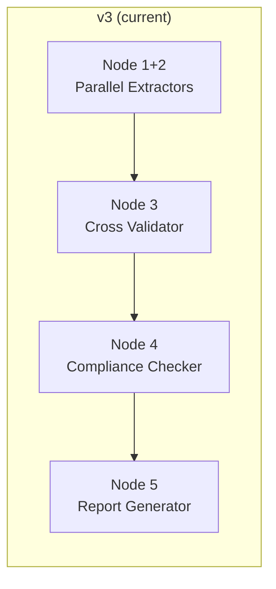
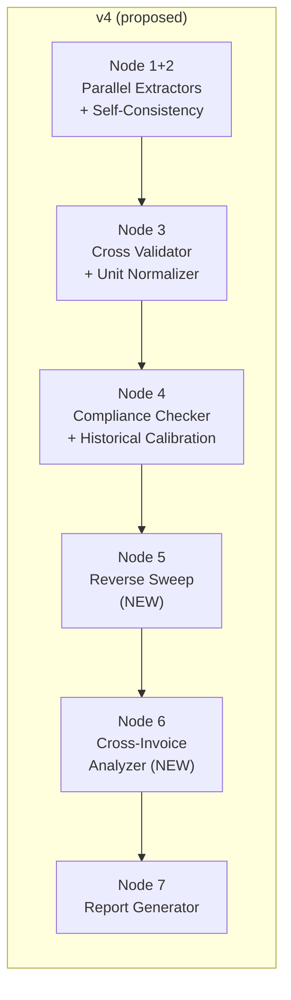

# Architecture v4 — Implementation Plan

## Overview

v4 evolves the v3 pipeline from **5 nodes → 8 nodes**, adding 6 accuracy layers that address the biggest real-world audit gaps: missing credits, unit mismatches, cross-invoice drift, and zero learning from past audits.

> [!IMPORTANT]
> **Core v3 principle preserved:** LLM extracts, Python computes. Nothing below violates this — every new accuracy layer is either deterministic Python or bounded LLM judgment with human-review fallback.

---

## Pipeline Comparison





---

## New Node Summary

| Node | Name | Type | What it adds |
|------|------|------|-------------|
| 1+2 | Parallel Extractors | Modified | Multi-pass self-consistency + clause byte anchoring |
| 3 | Cross Validator | Modified | Unit normalization layer before fuzzy matching |
| 4 | Compliance Checker | Modified | Historical calibration lookup before evaluation |
| **5** | **Reverse Sweep** | **NEW** | Checks contract rules that *should* have triggered but didn't |
| **6** | **Cross-Invoice Analyzer** | **NEW** | Detects price drift across invoices for the same item |
| 7 | Report Generator | Modified | Incorporates new finding types + feedback prompt |

---

## Improvement 1: Multi-Pass Self-Consistency

### What changes

**Files:** `contract_parser/agent.py`, `invoice_extractor/agent.py`, `config.py`

**Design:**

```
For each contract section:
    Run LLM extraction 3 times (temp 0.0, 0.1, 0.2)
    For each rule field across the 3 responses:
        If 2/3 agree → use majority value, confidence = 0.9
        If 3/3 agree → use value, confidence = 1.0
        If 0/3 agree → use temp=0.0 value, confidence = 0.3, add to review_flags
```

**New config values:**
```python
# config.py
SELF_CONSISTENCY_PASSES = get_int("SELF_CONSISTENCY_PASSES", 3)
SELF_CONSISTENCY_TEMPERATURES = [0.0, 0.1, 0.2]
```

**New function:**
```python
# contract_parser/tools.py
def vote_on_rules(
    extractions: List[ContractRulebook],   # 3 extraction results
) -> Tuple[ContractRulebook, List[ReviewFlag]]:
    """
    Majority-vote across multiple extraction passes.
    Returns merged rulebook + flags for disagreements.
    """
```

**Key constraint:** Only the *parameters* are voted on (unit_price, tiers, percentages). The `rule_type`, `applies_to`, and `clause_text` are taken from the temp=0.0 pass (most deterministic).

### Impact on costs
- 3x LLM calls for contract parsing (but sections are small, ~$0.01-0.03 per section)
- Invoice extraction: 2x calls only (temp 0.0, 0.1) — invoices are more structured, less ambiguity
- Can be disabled with `SELF_CONSISTENCY_PASSES=1` for cost-sensitive deployments

---

## Improvement 2: Clause Byte Anchoring

### What changes

**Files:** `schemas.py`, `contract_parser/agent.py`, prompt files

**New schema fields:**
```python
class PricingRule(BaseModel):
    # ... existing fields ...
    clause_start_offset: Optional[int] = None   # char position in contract_text
    clause_end_offset: Optional[int] = None     # char position in contract_text
```

**Verification step (replaces substring check):**
```python
# contract_parser/agent.py — verification step
for rule in merged_rulebook.rules:
    if rule.clause_start_offset is not None and rule.clause_end_offset is not None:
        actual_text = contract_text[rule.clause_start_offset:rule.clause_end_offset]
        # Normalize whitespace for comparison
        if normalize(actual_text) != normalize(rule.clause_text):
            # Offsets don't match — try substring fallback
            if normalize(rule.clause_text) not in normalize(contract_text):
                rule.extraction_confidence = 0.0  # hallucinated
            else:
                # Clause exists but offsets are wrong — fix offsets
                idx = normalize(contract_text).find(normalize(rule.clause_text))
                rule.clause_start_offset = idx
                rule.clause_end_offset = idx + len(rule.clause_text)
    else:
        # No offsets provided — fall back to existing substring check
        ...
```

**Prompt update:** Add to contract parser prompt:
```
For each rule, also provide:
- clause_start_offset: the character index where clause_text begins in the section text
- clause_end_offset: the character index where clause_text ends
```

---

## Improvement 3: Unit Normalization Layer

### What changes

**Files:** NEW `backend/core/unit_normalizer.py`, `cross_validator/validator.py`, `compliance_checker/agent.py`

**New module:**
```python
# backend/core/unit_normalizer.py

from decimal import Decimal
from typing import Optional, Tuple

# Canonical unit → {alias: conversion_factor}
UNIT_FAMILIES = {
    "MT": {
        "mt": 1, "metric tonne": 1, "metric ton": 1, "tonne": 1,
        "ton": 1, "tonnes": 1, "tons": 1, "MT": 1,
        "kg": Decimal("0.001"), "kilogram": Decimal("0.001"),
        "kilograms": Decimal("0.001"), "kgs": Decimal("0.001"),
        "g": Decimal("0.000001"), "gram": Decimal("0.000001"),
        "quintal": Decimal("0.1"), "quintals": Decimal("0.1"),
    },
    "unit": {
        "unit": 1, "units": 1, "piece": 1, "pieces": 1,
        "pc": 1, "pcs": 1, "nos": 1, "each": 1, "ea": 1,
        "number": 1, "numbers": 1, "qty": 1,
    },
    "hour": {
        "hour": 1, "hours": 1, "hr": 1, "hrs": 1,
        "day": 8, "days": 8,  # 1 day = 8 working hours
        "month": Decimal("176"), "months": Decimal("176"),  # 22 days * 8 hrs
    },
    "litre": {
        "litre": 1, "liter": 1, "litres": 1, "liters": 1,
        "l": 1, "L": 1,
        "ml": Decimal("0.001"), "millilitre": Decimal("0.001"),
        "kl": Decimal("1000"), "kilolitre": Decimal("1000"),
    },
    "sqft": {
        "sqft": 1, "sq ft": 1, "square feet": 1, "square foot": 1,
        "sqm": Decimal("10.764"), "sq m": Decimal("10.764"),
        "square meter": Decimal("10.764"), "square metre": Decimal("10.764"),
    },
}

def extract_unit(text: str) -> Optional[str]:
    """Extract unit from a description like '₹450 per MT' or '₹12/kg'."""
    ...

def normalize_to_common_unit(
    value: Decimal,
    from_unit: str,
    to_unit: str
) -> Optional[Tuple[Decimal, str]]:
    """
    Convert value from one unit to another.
    Returns (converted_value, canonical_unit) or None if incompatible.
    """
    ...

def units_are_compatible(unit_a: str, unit_b: str) -> bool:
    """Check if two units belong to the same family."""
    ...
```

**Integration in cross_validator:**
```python
# Before fuzzy matching, extract and compare units
rule_unit = extract_unit(rule.clause_text or rule.applies_to)
line_unit = extract_unit(item.raw_description)

if rule_unit and line_unit and not units_are_compatible(rule_unit, line_unit):
    # Incompatible units — don't match
    continue

if rule_unit and line_unit and rule_unit != line_unit:
    # Compatible but different — store conversion factor in candidate_map
    candidate_map[item.line_id].append({
        "rule_id": rule.rule_id,
        "unit_conversion": normalize_to_common_unit(Decimal("1"), line_unit, rule_unit)
    })
```

**Integration in compliance_checker:**
```python
# Before evaluate_line_rule, apply unit conversion if needed
if unit_conversion:
    # Adjust line_item quantities/prices to match rule's unit basis
    adjusted_line = line_item.model_copy()
    adjusted_line.quantity *= unit_conversion
    adjusted_line.unit_price_charged /= unit_conversion
    expected_total = evaluate_line_rule(adjusted_line, rule, invoice)
```

---

## Improvement 4: Bidirectional Verification (Reverse Sweep)

### What changes

**Files:** NEW `backend/agents/reverse_sweep/agent.py`, NEW `backend/agents/reverse_sweep/tools.py`, `schemas.py`, `pipeline.py`

This is a **new pipeline node** that runs after the compliance checker.

**New schemas:**
```python
# schemas.py additions

class MissingCreditFinding(BaseModel):
    finding_id: str              # "MC001", "MC002"...
    rule_id: str                 # The contract rule that should have triggered
    rule_type: str               # "early_payment_discount", "sla_penalty", etc.
    invoice_id: str
    trigger_evidence: str        # What evidence shows the rule should apply
    expected_credit: Optional[CleanDecimal]  # Estimated credit amount if calculable
    severity: Literal["CRITICAL", "HIGH", "MEDIUM"]
    description: str

class ReverseSweepResult(BaseModel):
    missing_credits: List[MissingCreditFinding]
    verified_rules: List[str]    # rule_ids confirmed as correctly applied/not-applicable
    inconclusive: List[str]      # rule_ids where we can't determine applicability
```

**Logic (pure Python + bounded LLM):**

```python
# reverse_sweep/agent.py

async def run_reverse_sweep(state: PipelineState) -> PipelineState:
    """
    Node 5: For each contract rule, check if it SHOULD have triggered
    but no corresponding invoice line/credit exists.

    Focuses on credit/discount/penalty rules that are commonly "forgotten."
    """
    CREDIT_RULE_TYPES = {
        "early_payment_discount",
        "sla_penalty",
        "bundle_discount",
    }

    rulebook = ContractRulebook.model_validate(state["rulebook"])
    invoices = [InvoiceData.model_validate(inv) for inv in state["invoice_data"]]
    existing_findings = state.get("discrepancies", {}).get("discrepancies", [])
    already_found_rules = {f["rule_id"] for f in existing_findings}

    missing_credits = []

    for rule in rulebook.rules:
        if rule.rule_type not in CREDIT_RULE_TYPES:
            continue
        if rule.rule_id in already_found_rules:
            continue  # Already flagged by Node 4

        for invoice in invoices:
            # Check 1: Early payment discount
            if rule.rule_type == "early_payment_discount":
                trigger = check_early_payment_trigger(rule, invoice)

            # Check 2: SLA penalty
            elif rule.rule_type == "sla_penalty":
                trigger = check_sla_penalty_trigger(rule, invoice)

            # Check 3: Bundle discount
            elif rule.rule_type == "bundle_discount":
                trigger = check_bundle_trigger(rule, invoice)

            if trigger.should_have_applied:
                # Verify: is there a credit line on the invoice?
                credit_exists = find_credit_line(invoice, rule)
                if not credit_exists:
                    missing_credits.append(MissingCreditFinding(...))

    state["reverse_sweep"] = ReverseSweepResult(
        missing_credits=missing_credits, ...
    ).model_dump()
    return state
```

**Trigger check functions (pure Python):**
```python
def check_early_payment_trigger(rule, invoice) -> TriggerResult:
    """
    Checks invoice notes/metadata for payment timing evidence.
    E.g. "Paid within 7 days" + rule says "2% discount if paid within 10 days"
    → should_have_applied = True, expected_credit = invoice_total * 0.02
    """

def check_sla_penalty_trigger(rule, invoice) -> TriggerResult:
    """
    Checks if any line item has sla_actual_pct < rule.sla_threshold_pct
    AND no penalty credit line exists.
    """

def check_bundle_trigger(rule, invoice) -> TriggerResult:
    """
    Checks if total quantity for rule.applies_to items > rule.bundle_threshold
    AND standard (non-bundle) pricing was charged.
    """
```

---

## Improvement 5: Cross-Invoice Analyzer

### What changes

**Files:** NEW `backend/agents/cross_invoice_analyzer/agent.py`, `schemas.py`, `pipeline.py`

**New schema:**
```python
class PriceDriftFinding(BaseModel):
    finding_id: str              # "PD001", "PD002"...
    item_description: str        # What item/service
    invoice_ids: List[str]       # Which invoices show the drift
    prices: List[CleanDecimal]   # The different unit prices found
    min_price: CleanDecimal
    max_price: CleanDecimal
    drift_pct: float             # (max - min) / min * 100
    expected_price: Optional[CleanDecimal]  # From contract, if matched
    severity: Literal["CRITICAL", "HIGH", "MEDIUM"]
    description: str

class CrossInvoiceResult(BaseModel):
    price_drifts: List[PriceDriftFinding]
    consistent_items: int        # Items with stable pricing
    total_items_compared: int
```

**Logic (100% Python — no LLM):**

```python
# cross_invoice_analyzer/agent.py

async def run_cross_invoice_analyzer(state: PipelineState) -> PipelineState:
    """
    Node 6: Compares unit prices for the same item across all invoices.
    Flags items where price varies by > PRICE_DRIFT_THRESHOLD_PCT.
    """
    invoices = [InvoiceData.model_validate(inv) for inv in state["invoice_data"]]

    # Group line items by mapped_contract_item (normalized)
    item_prices = defaultdict(list)  # {item_name: [(invoice_id, unit_price, qty)]}

    for inv in invoices:
        for line in inv.line_items:
            key = normalize_item_name(line.mapped_contract_item)
            item_prices[key].append({
                "invoice_id": inv.invoice_id,
                "unit_price": line.unit_price_charged,
                "quantity": line.quantity,
                "billing_period": inv.billing_period,
            })

    drifts = []
    for item_name, entries in item_prices.items():
        if len(entries) < 2:
            continue  # Need at least 2 invoices to compare

        prices = [e["unit_price"] for e in entries]
        min_p, max_p = min(prices), max(prices)

        if min_p > 0:
            drift_pct = float((max_p - min_p) / min_p * 100)
            if drift_pct > PRICE_DRIFT_THRESHOLD_PCT:  # default: 5%
                drifts.append(PriceDriftFinding(...))

    state["cross_invoice"] = CrossInvoiceResult(...).model_dump()
    return state
```

---

## Improvement 6: Historical Calibration / Feedback Loop

### What changes

**Files:** NEW `backend/models/feedback.py`, `backend/api/routes/feedback.py`, `compliance_checker/agent.py`, `schemas.py`

**New DB model:**
```python
# backend/models/feedback.py

class FindingFeedback(Base):
    __tablename__ = "finding_feedback"

    id = Column(String, primary_key=True)
    audit_id = Column(String, ForeignKey("audits.id"))
    finding_id = Column(String)           # F001, MC001, PD001, etc.
    supplier_name = Column(String)
    rule_id = Column(String)
    rule_type = Column(String)
    applies_to = Column(String)
    human_verdict = Column(String)        # CORRECT | FALSE_POSITIVE | FALSE_NEGATIVE | ADJUSTED
    adjusted_delta = Column(Float, nullable=True)
    reason = Column(String)
    reviewed_by = Column(String)
    reviewed_at = Column(DateTime)
```

**API endpoint:**
```
POST /api/audits/{audit_id}/findings/{finding_id}/feedback
{
    "verdict": "FALSE_POSITIVE",
    "reason": "This rate was renegotiated verbally, not in contract",
    "adjusted_delta": null
}
```

**Integration in compliance_checker (before creating a finding):**
```python
# compliance_checker/agent.py — before emitting a Discrepancy

historical = await lookup_feedback_history(
    supplier_name=rulebook.supplier_name,
    rule_type=rule.rule_type,
    applies_to=rule.applies_to,
)

if historical.false_positive_rate > 0.5:
    # This (supplier, rule) combination is wrong >50% of the time
    finding.confidence *= 0.5
    finding.narrative += " [Historical: this rule match has a high false-positive rate]"
    finding.recommendation = "REVIEW"
```

---

## Updated Pipeline Definition

```python
# pipeline.py — v4

def build_pipeline() -> StateGraph:
    graph = StateGraph(PipelineState)

    graph.add_node("parallel_extractors", run_parallel_extractors)  # Nodes 1+2 (self-consistency)
    graph.add_node("cross_validator", run_cross_validator)           # Node 3 (+ unit normalizer)
    graph.add_node("compliance_checker", run_compliance_checker)     # Node 4 (+ historical calibration)
    graph.add_node("reverse_sweep", run_reverse_sweep)              # Node 5 (NEW)
    graph.add_node("cross_invoice_analyzer", run_cross_invoice_analyzer)  # Node 6 (NEW)
    graph.add_node("report_generator", run_report_generator)        # Node 7

    graph.set_entry_point("parallel_extractors")

    graph.add_conditional_edges("parallel_extractors",
        lambda s: END if s.get("halt") else "cross_validator")
    graph.add_conditional_edges("cross_validator",
        lambda s: END if s.get("halt") else "compliance_checker")
    graph.add_conditional_edges("compliance_checker",
        lambda s: END if s.get("halt") else "reverse_sweep")
    graph.add_conditional_edges("reverse_sweep",
        lambda s: END if s.get("halt") else "cross_invoice_analyzer")
    graph.add_conditional_edges("cross_invoice_analyzer",
        lambda s: END if s.get("halt") else "report_generator")
    graph.add_edge("report_generator", END)

    return graph.compile()
```

---

## Updated PipelineState

```python
class PipelineState(TypedDict):
    # ... existing v3 fields ...

    # v4 additions
    reverse_sweep: NotRequired[Optional[Dict]]         # ReverseSweepResult
    cross_invoice: NotRequired[Optional[Dict]]          # CrossInvoiceResult
    unit_conversions: NotRequired[Optional[Dict]]       # {line_id: {rule_id: conversion_factor}}
    extraction_votes: NotRequired[Optional[Dict]]       # Self-consistency vote metadata
```

---

## File Change Summary

### New files to create

| File | Purpose | Effort |
|------|---------|--------|
| `backend/core/unit_normalizer.py` | Unit conversion/compatibility engine | Small |
| `backend/agents/reverse_sweep/__init__.py` | Package init | Trivial |
| `backend/agents/reverse_sweep/agent.py` | Missing credits detector | Medium |
| `backend/agents/reverse_sweep/tools.py` | Trigger check functions | Medium |
| `backend/agents/cross_invoice_analyzer/__init__.py` | Package init | Trivial |
| `backend/agents/cross_invoice_analyzer/agent.py` | Price drift detector | Small |
| `backend/models/feedback.py` | FindingFeedback DB model | Small |
| `backend/api/routes/feedback.py` | Feedback API endpoint | Small |

### Existing files to modify

| File | What changes | Effort |
|------|-------------|--------|
| `backend/agents/pipeline.py` | Add 2 new nodes to graph | Small |
| `backend/agents/contract_parser/agent.py` | Multi-pass extraction + byte anchoring | Medium |
| `backend/agents/contract_parser/tools.py` | Add `vote_on_rules()` function | Medium |
| `backend/agents/cross_validator/validator.py` | Unit normalization before matching | Small |
| `backend/agents/compliance_checker/agent.py` | Historical calibration lookup | Small |
| `backend/agents/report_generator/agent.py` | Include new finding types in report | Medium |
| `backend/models/schemas.py` | New models + PipelineState fields | Small |
| `backend/core/config.py` | New config params | Trivial |
| `.env` / `backend/.env` | New env defaults | Trivial |
| `ARCHITECTURE_v4.md` | New architecture doc | Medium |
| `DATA_SCHEMAS.md` | Regenerate with v4 schemas | Small |

---

## Implementation Phases

### Phase 1 — Quick wins (1-2 days)
> Accuracy gain: +10-18%

1. **Unit normalization** — `unit_normalizer.py` + integrate into `cross_validator`
2. **Cross-invoice analyzer** — new node, 100% Python, no LLM cost
3. **Pipeline update** — add Node 6 to graph

### Phase 2 — High-impact features (2-3 days)
> Accuracy gain: +15-20%

4. **Reverse sweep** — new node with trigger check functions
5. **Report generator update** — include missing credits + price drifts

### Phase 3 — Extraction accuracy (2-3 days)
> Accuracy gain: +13-20%

6. **Multi-pass self-consistency** — modify contract parser + invoice extractor
7. **Clause byte anchoring** — schema update + verification step
8. **Vote function** — `vote_on_rules()` implementation

### Phase 4 — Learning loop (1-2 days)
> Accuracy gain: +10-20% (compounds over time)

9. **FindingFeedback model** — DB migration
10. **Feedback API** — POST/GET endpoints
11. **Historical calibration** — integrate into compliance checker

---

## Non-Negotiable Rules (carried from v3 + new)

1. Contract Parser and Invoice Extractor run independently
2. Cross Validator is pure Python — no LLM calls
3. **Reverse Sweep is pure Python** — trigger checks are deterministic
4. **Cross-Invoice Analyzer is pure Python** — no LLM calls
5. All monetary values: Python Decimal, never float
6. LLM calls use `response_mime_type='application/json'` + Pydantic-derived JSON schema
7. Critic can ONLY add `NEEDS_HUMAN_REVIEW` annotations
8. **Unit conversions are explicit and logged** — never silently assumed
9. **Historical calibration adjusts confidence, never removes findings**
10. Self-consistency voting uses majority, with temp=0.0 as tiebreaker

---

> [!NOTE]
> The 6 improvements are **independent** — each can be implemented and deployed separately. Phase 1 can ship alone and already provides significant accuracy gain. Phases can overlap.
