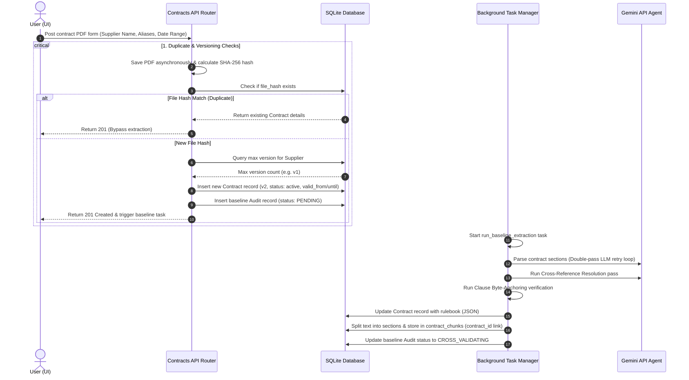

# Contract Library Upload: The Complete Deep Guide

This guide details the end-to-end lifecycle of a contract document once it is uploaded to the **ProcureAI Contract Library** in the user interface.



---

## Detailed Phase Breakdown

### Phase 1: Frontend Ingestion ([ContractLibrary.jsx](file:///d:/SupplierGuard/frontend/src/pages/ContractLibrary.jsx))
1. **User Action**: The user opens the **Contract Library** page, clicks **Add Contract**, inputs the supplier details (Supplier Name, Aliases, Validity Period), attaches a PDF file, and clicks **Register Contract**.
2. **Form Assembly**: The React UI compiles a `Multipart/FormData` package containing:
   - `file`: The raw binary contract PDF.
   - `supplier_name`: e.g. `"Apex Logistics Ltd"`.
   - `supplier_aliases`: e.g. `"Apex, Apex Ltd"` (comma-separated).
   - `valid_from` & `valid_until`: e.g. `"2026-01-01"`.
3. **HTTP Dispatch**: Sends a `POST` request to the backend endpoint `/api/contracts`.

---

### Phase 2: Endpoint Intake & Duplicate Checking ([contracts.py](file:///d:/SupplierGuard/backend/api/routes/contracts.py))
1. **Physical File Save**: The API router invokes `save_pdf_upload` to asynchronously write the binary bytes to the uploads directory (`data/uploads/contract_<hash>_<name>.pdf`).
2. **Deterministic Hashing**: The backend calculates the **SHA-256** checksum of the PDF's bytes.
3. **Database Cache Check**: The system queries the `contracts` table:
   ```sql
   SELECT * FROM contracts WHERE file_hash = :file_hash LIMIT 1;
   ```
   - **Case A (Duplicate Found)**: If the hash already exists, the backend instantly returns the existing contract's cached metadata, rulebook, and version number. **No LLM calls are triggered**.
   - **Case B (New Contract)**: If the hash is new, the backend proceeds to calculate the versioning logic.

---

### Phase 3: Versioning & DB Insertion ([contracts.py](file:///d:/SupplierGuard/backend/api/routes/contracts.py))
1. **Version Assignment**: The system counts existing contracts for this supplier:
   ```sql
   SELECT MAX(version) FROM contracts WHERE LOWER(supplier_name) = :supplier_name;
   ```
   It assigns `version = max_version + 1` (defaulting to `1` for the first contract).
2. **Contract Registration**: Inserts a row into the `contracts` table with:
   - `id`: Unique prefix ID (e.g. `ctr_apex_logistics_ltd_1a2b`).
   - `file_hash`: The calculated SHA-256 hash.
   - `version`: The resolved version number.
   - `valid_from` & `valid_until`: Dates specified in the form.
   - `rulebook`: Left `NULL` (to be populated asynchronously).
3. **Baseline Audit Creation**: Creates a system audit record (`base_ctr_<id>`) in the `audits` table. This baseline audit acts as a temporary container holding logs and parsing states.
4. **Immediate Response**: The server returns a `201 Created` status code to the user, and hands off the heavy processing to Python's asynchronous background task manager.

---

### Phase 4: Background Term Extraction ([agent.py](file:///d:/SupplierGuard/backend/agents/contract_parser/agent.py))
FastAPI spawns a non-blocking background task running `run_baseline_extraction`, which runs the **Multi-Agent Parsing Pipeline**:

1. **PDF Text Extraction**: The parser reads the PDF document text in a background thread using `asyncio.to_thread`.
2. **Contract Section Chunking**: Splits the contract into logical sections (e.g. "Section 4.1 flat rate", "Schedule B SLA penalties") based on headers.
3. **Multi-Pass LLM Rule Extraction**:
   - For each section, it calls Gemini using structured JSON outputs matching the `ContractRulebook` schema.
   - To achieve self-consistency, it runs multiple passes at different temperatures, voting on the best matching clauses.
   - **Self-Correction Loop**: If the LLM generates JSON that fails Pydantic schema validation, the error feedback is fed back to the LLM for a automatic correction retry.
4. **Cross-Reference Resolution**: Scans the extracted rules for sections that cross-reference other chapters (e.g., *"under SLAs defined in Schedule C"*). It feeds unresolved sections back to Gemini with the full text context to resolve them.
5. **Clause Verification (Hallucination Guard)**: Deterministically searches the raw contract text for the exact sentences quoted by the LLM. If a clause does not exist in the PDF, it flags it as a hallucination, sets the rule's confidence to `0.0`, and records an audit error.

---

### Phase 5: Cache Registration & BM25 Chunking
1. **Rulebook Caching**: The merged and validated rulebook is serialized to a JSON string and saved to both the `Audit` record and the `Contract` record in the database:
   ```sql
   UPDATE contracts SET rulebook = :rulebook_json WHERE id = :contract_id;
   ```
2. **Contract Text Chunking**: The contract text is segmented into overlapping chunks of 500 characters and saved in the `contract_chunks` table, linked to the `contract_id`:
   ```sql
   INSERT INTO contract_chunks (contract_id, chunk_index, chunk_text, section_header) ...
   ```
3. **Completion Event**: The baseline audit status shifts to `CROSS_VALIDATING` (which marks it as successful baseline extraction). The library is now seeded. Future invoice audits against this supplier will fetch this rulebook and its chunks in milliseconds.
