# ProcureAI: Realistic System Flow Diagrams & Architecture

This document contains **clean, realistic engineering flow diagrams** for the ProcureAI system and presentation slides. It includes native **Mermaid flowchart diagrams** (rendering natively in Markdown viewers, GitHub, and Antigravity) and links to standalone **16:9 vector SVG diagrams** ready for presentation decks.

---

## 🧭 Diagram Index

1. [Slide 1: Enterprise Spend Leakage & AP Disconnect Flow](#1-slide-1-enterprise-spend-leakage--ap-disconnect-flow)
2. [Slide 2: Governed Multi-Agent Architecture (8-Stage Stateful Pipeline)](#2-slide-2-governed-multi-agent-architecture-8-stage-pipeline)
3. [Slide 3: Prodapt Synapt Context Substrate 4-Store & Dual-Loop Retrieval](#3-slide-3-prodapt-synapt-context-substrate-4-store-architecture)
4. [Vector SVG Presentation Assets](#4-presentation-svg-assets)

---

## 1. Slide 1: Enterprise Spend Leakage & AP Disconnect Flow

### Realistic Flow Diagram (Mermaid)

```mermaid
flowchart TD
    subgraph TraditionalAP ["Traditional Enterprise Reality (Flawed Status Quo)"]
        direction LR
        A1["1. Procurement & Legal<br/><b>60-page Master Contract</b><br/>• Volume Tier Schedules<br/>• SLA Downtime Rebates<br/>• Amendments & Addenda"]
        A2["Silo Disconnect<br/><i>Contracts locked in PDFs</i>"]
        A3["2. Accounts Payable & ERP<br/><b>Standard 3-Way Match</b><br/>• PO == Invoice == Receipt<br/>• <font color='red'>Zero clause validation</font><br/>• Manual spot-check &lt;5% spend"]
        A4["3. Silent Spend Leakage<br/><b>2% to 5% Lost Spend</b><br/>• ₹25L–₹50L lost per vendor<br/>• Unapplied volume tiers<br/>• Stale rate billing creep"]

        A1 --> A2 --> A3 --> A4
    end

    subgraph ProcureAIFlow ["ProcureAI Automated Guardrail (Autonomous 100% Audit)"]
        direction LR
        B1["Ingest & Index<br/><b>PDF Contracts + Invoices</b><br/>• Synapt Context Substrate<br/>• Neo4j Clause Hierarchy<br/>• Milvus Rate Cards"]
        B2["Multi-Agent Pipeline<br/><b>Governed Execution</b><br/>• Node 3b Substrate Enricher<br/>• Reverse Sweep (Missed credits)<br/>• Drift Analyzer (Price creep)"]
        B3["Zero-Math Verification<br/><b>Python Decimal Engine</b><br/>• 0% Math Hallucination<br/>• 5-Stage Pass Card (98% Grounded)<br/>• CFO Dispute Package"]
        B4["Verified ROI<br/><b>₹4,340 Recovered (3 Invoices)</b><br/>• 90-second execution (98% faster)<br/>• 100% line-item coverage<br/>• Human-in-the-loop signoff"]

        B1 --> B2 --> B3 --> B4
    end

    A4 -.->|"Replaced By"| ProcureAIFlow

    style TraditionalAP fill:#1e1418,stroke:#b91c1c,stroke-width:1.5px
    style ProcureAIFlow fill:#0f1f1d,stroke:#0d9488,stroke-width:1.5px
    style A4 fill:#450a0a,stroke:#ef4444,stroke-width:2px,color:#fca5a5
    style B4 fill:#064e3b,stroke:#10b981,stroke-width:2px,color:#6ee7b7
```

* **Vector SVG Asset:** [slide1_spend_leakage_flow.svg](file:///d:/sultan/ProcureAI/procureai/docs/visuals/slide1_spend_leakage_flow.svg)

---

## 2. Slide 2: Governed Multi-Agent Architecture (8-Stage Pipeline)

### Realistic Flow Diagram (Mermaid)

```mermaid
flowchart TD
    subgraph Inputs ["Input Layer"]
        C_PDF["Contract PDF/Docx<br/>(Master Agreement + Addenda)"]
        I_PDF["ERP Invoices<br/>(Monthly Billing PDFs/CSVs)"]
    end

    subgraph S1 ["Stage 1: Parallel Ingestion"]
        P_Contract["Contract Parser Agent<br/>• Pricing Schedules<br/>• SLA Commitments<br/>• Amendment Clauses"]
        P_Invoice["Invoice Extractor Agent<br/>• Gemini 3.7 Structured JSON<br/>• Dual-Pass Consistency<br/>• Line items & Metadata"]
    end

    subgraph S2 ["Stage 2: Deterministic Gate"]
        CrossVal["Cross-Validator Agent<br/>• Fuzzy Vendor Entity Resolution<br/>• Unit Normalization (Hrs, Mbps, Qty)<br/>• Currency & Baseline Lock"]
    end

    subgraph S3 ["Stage 3: Synapt IP Integration"]
        Enricher["<b>Substrate Enricher Agent (Node 3b)</b><br/>• Queries Neo4j Concept Graph & Milvus<br/>• Resolves SUPERSEDES Amendment Chain<br/>• Deactivates Obsolete 2024 Clauses<br/>• Injects Active 2025 Governing Rates"]
    end

    subgraph S4 ["Stage 4: Compliance Critic"]
        Critic["Compliance Critic & Reflection<br/>• Pure Python Decimal Engine<br/>• Evaluates Tier Brackets & Caps<br/>• Flags Rate Mismatches & Overcharges<br/>• Zero-Math Hallucination Invariant"]
    end

    subgraph S5_6 ["Stage 5 & 6: Proactive Discovery"]
        RevSweep["Stage 5: Reverse Sweep<br/>• Hunts unapplied volume rebates<br/>• Checks SLA downtime credits<br/>• Early payment 2% discount"]
        Drift["Stage 6: Drift Analyzer<br/>• Historical price creep across cycles<br/>• Baseline drift from Month 1 to N<br/>• Stealth margin expansion detection"]
    end

    subgraph S7_8 ["Stage 7 & 8: Recovery & Governance"]
        Report["Stage 7: Report Generator<br/>• CFO Audit Summary<br/>• Formal Dispute Recovery Letter<br/>• Interactive Reasoning Subgraph"]
        HITL["Stage 8: Human-In-The-Loop Gate<br/>• AP Lead Review & Sign-Off<br/>• One-Click ERP Webhook Sync"]
    end

    C_PDF --> P_Contract
    I_PDF --> P_Invoice
    P_Contract --> CrossVal
    P_Invoice --> CrossVal
    CrossVal --> Enricher
    Enricher --> Critic
    Critic --> RevSweep
    RevSweep --> Drift
    Drift --> Report
    Report --> HITL

    style S3 fill:#0c2825,stroke:#14b8a6,stroke-width:2px
    style Enricher fill:#134e4a,stroke:#2dd4bf,stroke-width:2px,color:#f0fdfa
    style Critic fill:#1e1b4b,stroke:#6366f1,stroke-width:1.5px
    style RevSweep fill:#271e0c,stroke:#f59e0b,stroke-width:1.5px
    style Drift fill:#0f1d38,stroke:#3b82f6,stroke-width:1.5px
    style HITL fill:#2e1808,stroke:#f59e0b,stroke-width:2px,color:#fef3c7
```

* **Vector SVG Asset:** [slide2_governed_pipeline_flow.svg](file:///d:/sultan/ProcureAI/procureai/docs/visuals/slide2_governed_pipeline_flow.svg)

---

## 3. Slide 3: Prodapt Synapt Context Substrate 4-Store Architecture

### Realistic Flow Diagram (Mermaid)

```mermaid
flowchart LR
    subgraph DataLayer ["1. Synapt Context Substrate: 4 Enterprise Stores"]
        direction TB
        Neo4j["<b>Neo4j Concept Graph</b><br/>• Structural Clause Ontology<br/>• Hierarchy: Contract ➔ Addendum<br/>• Relationships: SUPERSEDES, BILLED_ON"]
        MilvusKS["<b>Milvus Knowledge Store (KS)</b><br/>• Verbatim clause embeddings<br/>• Exact legal text & warranty citations<br/>• Tied to page & section metadata"]
        MilvusPS["<b>Milvus Procedural Store (PS)</b><br/>• Dispute recovery SOPs as DAGs<br/>• Escalation workflows & grace periods"]
        MilvusGN["<b>Milvus Graph Node Index (GN)</b><br/>• Semantic GPS (query ➔ node entry)<br/>• Fast alias resolution (e.g. Cloud Eng II)"]
    end

    subgraph GatewayLayer ["2. Trident MCP & Dual-Loop Query Engine"]
        direction TB
        MCP["<b>Trident MCP Interface Gateway</b><br/>• Model Context Protocol tool server<br/>• Functions: query_substrate(), walk_graph()"]
        DualLoop["<b>Dual-Loop Execution</b><br/>• Loop A: Vector similarity + BM25 (KS)<br/>• Loop B: Epistemic Graph Walk (Neo4j)"]
        PassCard["<b>5-Stage Verification Pass Card</b><br/>1. Vector Sim (0.94)<br/>2. BM25 Lexical (0.89)<br/>3. Cross-Encoder Rerank (0.96)<br/>4. Graph Continuity (Verified)<br/>5. Grounding Score (98% - 0% Hallucination)"]
    end

    subgraph AgentLayer ["3. ProcureAI Agent Workflow Consumption"]
        direction TB
        SubEnrich["<b>Substrate Enricher Agent (Node 3b)</b><br/>• Calls Trident MCP before compliance<br/>• Overrides obsolete rates with active addenda<br/>• Resolves cap constraints & parent clauses"]
        Visualizer["<b>Reasoning Subgraph Visualizer</b><br/>• Interactive UI graph for finance leaders<br/>• Clickable nodes with legal source citations<br/>• Pass card audit trust certificate"]
    end

    DataLayer --> MCP
    MCP --> DualLoop
    DualLoop --> PassCard
    PassCard --> SubEnrich
    SubEnrich --> Visualizer

    style DataLayer fill:#0e1422,stroke:#334155,stroke-width:1.5px
    style GatewayLayer fill:#0f2027,stroke:#0284c7,stroke-width:1.5px
    style AgentLayer fill:#0d2625,stroke:#14b8a6,stroke-width:2px
    style SubEnrich fill:#134e4a,stroke:#2dd4bf,stroke-width:2px,color:#ffffff
    style PassCard fill:#042f2e,stroke:#10b981,stroke-width:1.5px,color:#ecfdf5
```

* **Vector SVG Asset:** [slide3_synapt_substrate_flow.svg](file:///d:/sultan/ProcureAI/procureai/docs/visuals/slide3_synapt_substrate_flow.svg)

---

## 4. Presentation SVG Assets

All diagrams are exported as **clean, crisp 16:9 vector graphics** with zero blurriness and realistic enterprise engineering layout:

| Slide | Subject | Vector SVG File | Direct Link |
| :--- | :--- | :--- | :--- |
| **Slide 1** | **Spend Leakage Problem** (Contracts vs Invoices = 2-5% Leakage) | `slide1_problem_simple.jpg` | [View Image](file:///d:/sultan/ProcureAI/procureai/docs/visuals/slide1_problem_simple.jpg) |
| **Slide 2** | **5-Step Multi-Agent Pipeline** (Ingestion ➔ Gate ➔ Substrate ➔ Zero-Math ➔ Human) | `slide2_pipeline_simple.jpg` | [View Image](file:///d:/sultan/ProcureAI/procureai/docs/visuals/slide2_pipeline_simple.jpg) |
| **Slide 3** | **Prodapt Synapt Context Substrate** (4-Stores ➔ Trident MCP ➔ 100% Grounded) | `slide3_substrate_simple.jpg` | [View Image](file:///d:/sultan/ProcureAI/procureai/docs/visuals/slide3_substrate_simple.jpg) |
| **Slide 5** | **Enterprise Governance & Scalability** (Continuous Governance across 4 Verticals) | `slide5_impact_simple.jpg` | [View Image](file:///d:/sultan/ProcureAI/procureai/docs/visuals/slide5_impact_simple.jpg) |
| **Interactive Suite** | All Diagrams in One Web App (Export / Dark & Light Mode) | `ProcureAI_System_Flow_Diagrams.html` | [View Web App](file:///d:/sultan/ProcureAI/procureai/docs/visuals/ProcureAI_System_Flow_Diagrams.html) |
