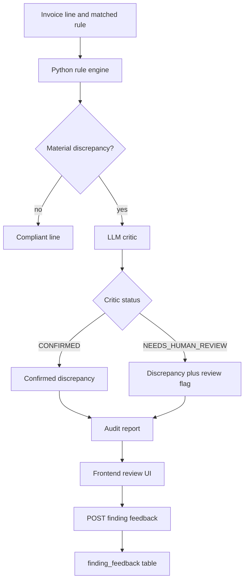

# Human Review Guide

**Audience:** Developers, auditors, and business reviewers.

The human review loop lets SupplierGuard keep a finding visible while marking it as needing human judgment. This is used when the deterministic math finds a discrepancy but contract language, source data, or business context may require reviewer interpretation.

## Implementation Summary



## Key Code Paths

| Area | File |
|---|---|
| Discrepancy creation and critic call | `backend/agents/compliance_checker/agent.py` |
| Critic prompt | `backend/agents/compliance_checker/prompt_critic.txt` |
| Report generation | `backend/agents/report_generator/agent.py` |
| Feedback endpoint | `backend/api/routes/audit.py` |
| Feedback table | `backend/models/audit.py` (`FindingFeedback`) |
| Frontend report UI | `frontend/src/pages/AuditReport.jsx` |
| Frontend API wrapper | `frontend/src/api.js` (`submitFindingFeedback`) |

## Critic Behavior

The critic can return:

- `CONFIRMED`
- `NEEDS_HUMAN_REVIEW`

The critic must not delete or rewrite the Python-computed finding. When it returns `NEEDS_HUMAN_REVIEW`, the finding remains in the report and a review flag is added with reasoning.

## Feedback Payload

```json
{
  "verdict": "CORRECT",
  "reason": "Reviewer confirmed this charge violates the contract.",
  "adjusted_delta": null,
  "reviewed_by": "human_reviewer"
}
```

Supported verdicts are documented in the route model comment as:

- `CORRECT`
- `FALSE_POSITIVE`
- `FALSE_NEGATIVE`
- `ADJUSTED`

## Database Storage

Feedback is stored in `finding_feedback` with audit ID, finding ID, supplier metadata, rule metadata when available, human verdict, adjusted delta, reason, reviewer, and review timestamp.

## Reviewer Guidance

Use human review for cases such as:

- Ambiguous contract wording.
- Missing operational data, such as SLA evidence or milestone responsibility.
- Supplier notes that conflict with simple rule application.
- Out-of-contract invoice items that may have separate approval.
- Historical false-positive patterns.

A reviewer should leave enough reason text for future auditors to understand the decision.
